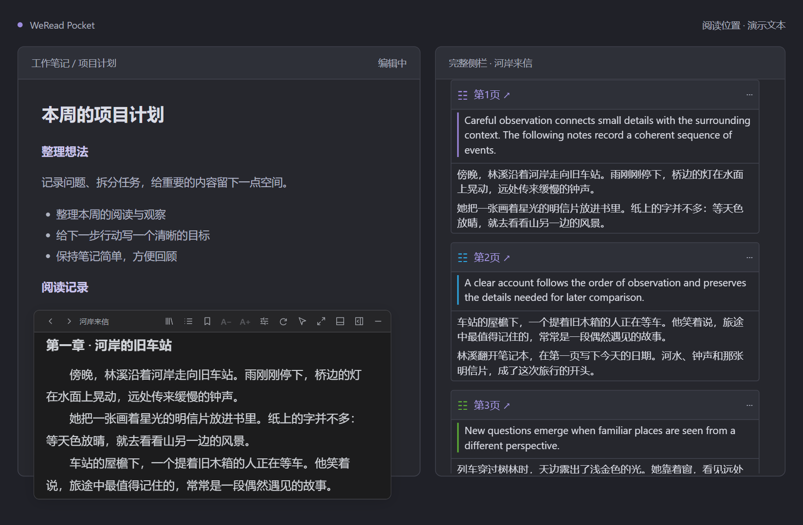
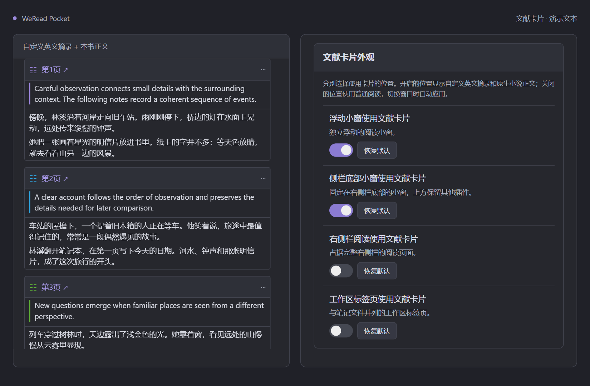
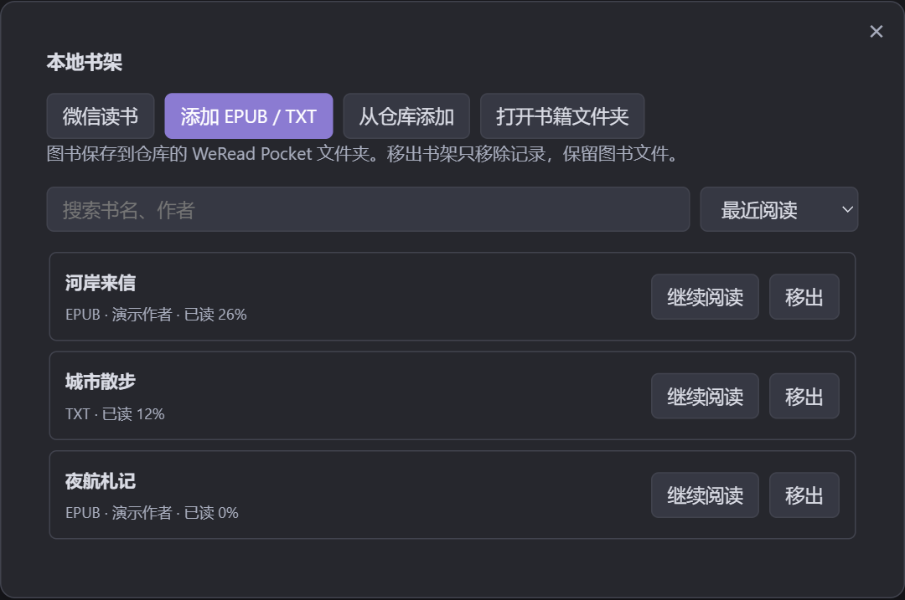
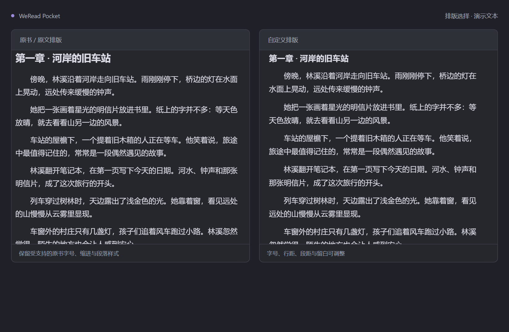
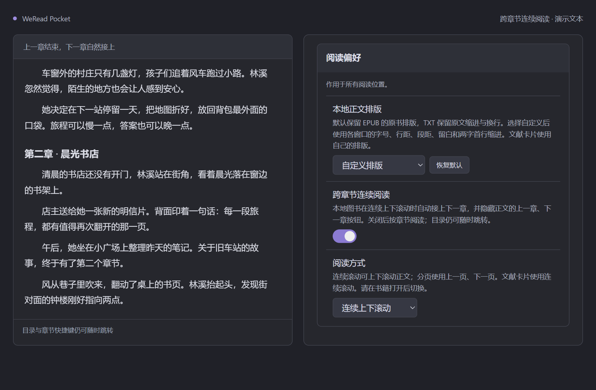
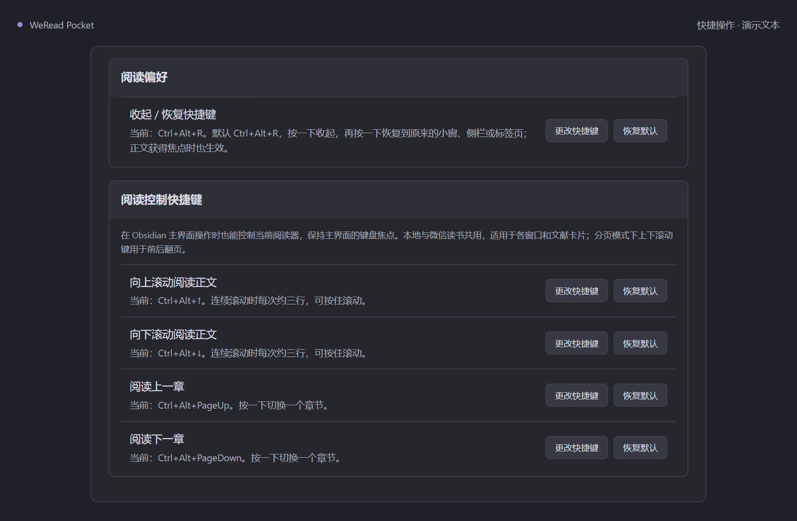
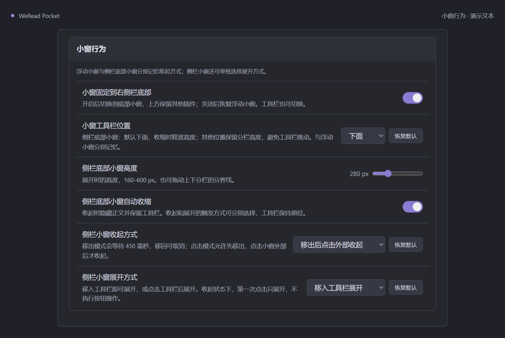
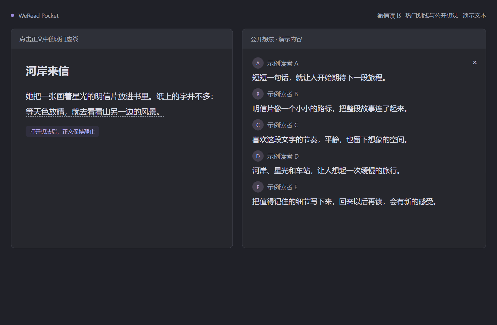

# WeRead Pocket

**在 Obsidian 里读微信读书，也读本地 EPUB / TXT。**

浮动小窗、侧栏与文献卡片，让阅读和笔记放在同一个工作区。一个快捷键收起，再按一次继续；也适合随手打开的「摸鱼阅读」。

[](https://github.com/Antonalia/weread-pocket/releases/latest)
[](./docs/compatibility.md)
[](./LICENSE)

[下载最新版本](https://github.com/Antonalia/weread-pocket/releases/latest) · [使用指南](./docs/usage.md) · [反馈问题](https://github.com/Antonalia/weread-pocket/issues) · [更新记录](./CHANGELOG.md)



**左为浮动小窗，右为侧栏卡片，对照展示不同阅读位置。** 在不同位置之间移动时，复用同一个阅读器并保留当前位置。

> 需要 **Obsidian 1.13.7+ 桌面版**，已验证 Windows。目前通过 GitHub Release 手动安装，尚未上架 Obsidian 社区插件目录。
>
> 图片中的书名、正文、工作笔记和读者信息均为自编演示内容。界面预览由插件组件与排版代码生成，实际外观随 Obsidian 主题变化。

## 功能一览

| 想做什么 | 对应功能 |
| --- | --- |
| 边记笔记边阅读 | 浮动小窗、侧栏底部小窗、完整右侧栏、工作区标签页 |
| 随时收起，快速回来 | 同键收起 / 恢复；小窗可选自动隐藏和工具栏位置 |
| 用文献笔记的形式阅读 | 自定义标题与英文摘录，各位置独立开启文献卡片 |
| 看本地电子书 | EPUB / TXT 书架、原书或自定义排版、逐书进度 |
| 找回刚才的位置 | 本地书签，保存章节、段落与段内位置 |
| 查找书中的文字 | 本地全文搜索，结果摘录、定位和临时高亮 |
| 一直往下读 | 本地跨章节连续阅读，可在设置中关闭 |
| 不离开主界面也能翻书 | 可修改的滚动、翻页和章节快捷键 |
| 看其他读者的想法 | 微信读书热门划线入口与只读笔记面板 |

## 图片介绍

### 文献卡片：英文摘录在上，书籍正文在下



在「设置 → WeRead Pocket → 文献卡片外观」填写标题和英文，用空行分隔不同摘录。浮动小窗、底部小窗、完整侧栏和标签页分别选择是否使用卡片；标题和英文共用。

卡片使用黄、红、绿、蓝、淡紫五色，同一章节的配色顺序保持稳定。普通正文与卡片的字号、行距和留白分别记忆，英文与中文使用一致的排版；卡片采用连续滚动。

### 本地书架：EPUB 与 TXT 放在一起



点击工具栏的书架图标，选择「添加 EPUB / TXT」或「从仓库添加」。导入的文件保存在笔记库的 **`WeRead Pocket/`**，可从左侧文件列表或书架打开，重新打开会恢复各自的阅读进度。

书架支持书名 / 作者筛选和排序；「移出」保留图书文件。点击「微信读书」切回官方书架，本地阅读无需微信登录。

### 本地书签：把值得回来的位置留下


打开本地图书后，从小窗的书签按钮或完整阅读页的「更多」菜单进入「本书书签」。点击「添加当前位置」保存，之后点击摘录即可回到原位置；每本书单独保存，最多 500 个。

### 全文搜索：从全书找到那句话


同一菜单中选择「搜索本书」，输入正文文字。搜索会逐章扫描当前 EPUB / TXT，显示章节和命中摘录；点击结果跳转到匹配文字并短暂高亮。

扫描过程中可停止，最多显示 200 条结果。支持普通文字匹配与跨行内标签的文字，不支持跨段短语、正则表达式或图片 OCR。

### 原书与自定义排版：按自己的习惯读



本地默认使用「原书 / 原文排版」：EPUB 保留受支持的书内字号、缩进与段落样式，TXT 保留原文缩进和换行。选择「自定义排版」后，可调整字号、行距、段距和留白，普通正文使用两字首行缩进。

从工具栏的排版按钮或「设置 → 各窗口排版」调整。四个位置分别记忆，普通阅读和文献卡片互不覆盖；背景与文字颜色跟随所选主题。

### 跨章节连续阅读：下一章自然接上



「跨章节连续阅读」默认开启，向下滚动自动接上相邻章节，正文不再显示上一章 / 下一章按钮。目录和章节快捷键仍可随时跳转；关闭后恢复按章阅读。

此开关用于本地图书的连续滚动。阅读方式也可选择分页，文献卡片使用连续滚动。

### 快捷键：在主界面操作，也能控制阅读



| 默认快捷键 | 操作 |
| --- | --- |
| `Ctrl+Alt+R` | 收起阅读器；再次按下恢复到原来的位置 |
| `Ctrl+Alt+↑` / `↓` | 向上 / 向下滚动；分页时用于前后翻页 |
| `Ctrl+Alt+PageUp` / `PageDown` | 上一章 / 下一章 |

在插件设置的「阅读偏好」更改收起 / 恢复快捷键，在「阅读控制快捷键」逐项更改滚动和章节绑定。焦点留在 Obsidian 主界面时也能控制阅读，适用于微信读书、本地书和各阅读位置。书签及搜索也提供命令，可自行绑定快捷键。

### 小窗行为：工具栏和收起方式由你选择



工具栏可放在上、下、左、右四条边，浮动和底部小窗分别记忆。自动收起可选「鼠标移出」或「移出后点击外部」；底部小窗可选移入工具栏展开或点击展开，收起时保留工具栏。

浮动小窗隐藏后用收起 / 恢复快捷键打开。底部小窗释放出的上方空间可继续留给其他插件。

### 微信读书热门划线：只滚动想法，正文保持静止



点击正文中的热门虚线查看相关公开想法。面板保持只读、间距紧凑，阅读笔记时正文不会跟着滚动。

在「设置 → 热门划线与笔记」按普通阅读 / 文献卡片及四个位置分别设置显示。此功能用于微信读书；本地图书使用书签与全文搜索。

## 安装与开始阅读

1. 打开 [GitHub Releases](https://github.com/Antonalia/weread-pocket/releases/latest)，下载 **`weread-pocket-1.1.0.zip`**，或分别下载 **main.js、manifest.json、styles.css**。自动生成的 Source code 压缩包用于开发。
2. 在笔记库中创建 `.obsidian/plugins/weread-pocket/`；自定义配置目录时使用实际目录名。
3. 将三个插件文件直接放入该文件夹。更新时覆盖这三个文件，保留原有 `data.json`。
4. 重新加载 Obsidian，在「设置 → 社区插件」关闭受限模式并启用 **WeRead Pocket**。
5. 用阅读按钮或命令打开阅读器。微信读书通过官方网页扫码登录、选书；本地书通过「本地书架」添加。

```text
你的笔记库/
├─ WeRead Pocket/                 # 导入的 EPUB / TXT
└─ .obsidian/plugins/weread-pocket/
   ├─ main.js
   ├─ manifest.json
   └─ styles.css
```

完整操作见[使用指南](./docs/usage.md)，格式范围与环境限制见[兼容性说明](./docs/compatibility.md)。

## 来源切换与资源占用

同一来源切换窗口复用阅读器。切换微信读书与本地图书时，保存当前位置并释放上一来源的界面与资源；本地阅读期间不保留官方网页，返回微信读书时重新加载最近的地址，沿用已有登录会话。

本地图书按需读取，连续阅读最多保留三个相邻章节；图片接近可见区域再加载，章节预加载、图片尺寸和缓存有数量限制。全文搜索逐章扫描，不常驻全书搜索索引。单个超大章节仍可能占用较多内存，详见[资源控制说明](./docs/compatibility.md#资源控制与搜索限制)。

## 账号、网络与本地数据

本地图书在本机解析，正文不会上传。导入将 EPUB、TXT 复制到当前仓库的 `WeRead Pocket/`，保留外部原文件；旧版外部书架引用会迁入该文件夹并保留进度。文件可随现有仓库同步服务同步，进度与书签是否同步取决于该服务是否包含插件数据。

微信读书连接官方服务 `weread.qq.com`，扫码使用 `open.weixin.qq.com`。个人书架、阅读进度及部分内容需要账号；购买与会员权限由官方服务处理。

- 书架索引、阅读进度、书签、排版、阅读地址和自定义英文保存在本机插件 `data.json` 中。
- 微信登录会话由 Electron 的持久会话分区管理，属于 Obsidian 应用数据区中的浏览器存储。
- 插件没有独立统计上报、第三方分析 SDK 或自更新器；嵌入的官方网页有自己的网络行为与[使用协议](https://cdn.weread.qq.com/app/weread_user_agreement_android.html)。

插件不生成微信读书概要笔记，也不自动清理已有笔记。文献卡片只是显示外观，不创建 Zotero 条目或真实文献引用。

## 开发与发布

使用 Node.js 20+ 的标准库构建，无第三方构建依赖。

```bash
npm ci
npm run verify
npm run package
```

`npm run package` 使用 Windows PowerShell，在 `dist/1.1.0/` 生成三个插件文件、`weread-pocket-1.1.0.zip` 与 `SHA256SUMS.txt`。脚本不会自动推送、发布或修改笔记库。

| 文件夹 / 文件 | 内容 |
| --- | --- |
| `src/` | 插件、微信读书桥接、卡片、划线、本地图书解析与阅读器 |
| `tests/` | 本地回归检查与浏览器夹具 |
| `scripts/` | 构建、检查、打包 |
| `docs/` | 功能图片、使用、开发、兼容性和发布说明 |
| 根目录 `main.js` | 构建生成的入口，不提交到 Git |
| `manifest.json` / `versions.json` | Obsidian 元数据与版本兼容映射 |

[开发说明](./docs/development.md) · [发布清单](./docs/releasing.md) · [兼容性](./docs/compatibility.md) · [更新记录](./CHANGELOG.md)

## English overview

**WeRead Pocket is a desktop Obsidian plugin for the official WeRead (微信读书) reader and local EPUB/TXT books.** Read beside your notes in a floating window, bottom sidebar pane, full sidebar, or workspace tab. One customizable shortcut hides and restores the reader; scrolling and chapter shortcuts work while focus remains on your notes.

- **Local bookshelf:** import EPUB/TXT into `WeRead Pocket/`, resume per-book progress, and choose supported publisher styles or custom typography.
- **Bookmarks and full-text search:** save reading positions, search the current local book chapter by chapter, and jump to a highlighted match. Up to 500 bookmarks per book and 200 search results.
- **Literature cards:** customizable English excerpts above the original content, with appearance and typography saved per reading position.
- **Reader lifecycle:** moving between windows reuses the reader; changing book sources releases the previous source. Returning to WeRead reloads the saved page with the existing login session.

Requires Obsidian 1.13.7+ on desktop; tested on Windows. Install the three plugin files from [GitHub Releases](https://github.com/Antonalia/weread-pocket/releases/latest). Local reading is offline; WeRead requires network access. This plugin has not been submitted to the community directory. It does not bypass paid access. All pictured books, notes and reader identities are fictional demo content.

本地书架的目录与进度工作流参考了 [UNreader 的公开说明](https://github.com/UNcore-gh/UNreader#readme)。本项目保留自己的外观与窗口控制，独立实现本地图书来源。

## 许可与关联

源码采用 [MIT License](./LICENSE)，作者 antonalia。Obsidian、微信读书及相关商标属于各自权利人；本项目为独立的第三方项目。
