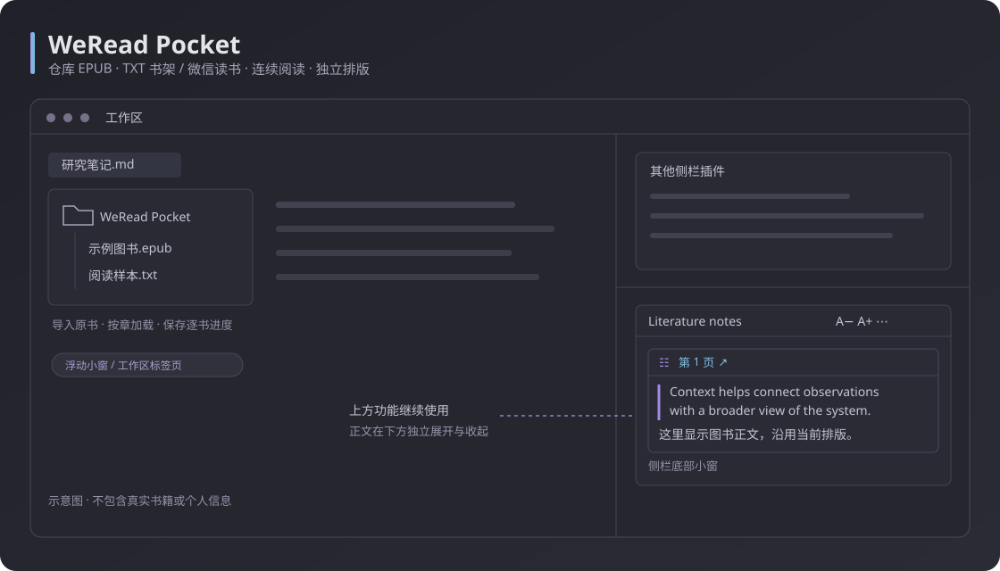

# WeRead Pocket

**在 Obsidian 里读微信读书，也读本地 EPUB / TXT。** WeRead Pocket 是一个桌面端 Obsidian 阅读插件：用浮动小窗或侧栏边记笔记边阅读，也适合想随手收起、继续打开的「摸鱼阅读」场景。支持文献卡片外观、自定义快捷键与按窗口保存的排版。

[](./manifest.json)
[](./docs/compatibility.md)
[](./LICENSE)

[下载最新版本](https://github.com/Antonalia/weread-pocket/releases/latest) · [使用指南](./docs/usage.md) · [反馈问题](https://github.com/Antonalia/weread-pocket/issues)



> **桌面端 · 手动安装。** 需要 Obsidian **1.13.7 或更新版本**，实际验证环境为 Windows；暂未提交 Obsidian 社区插件目录，不能在内置市场搜索安装。微信读书网页内部结构变化可能影响功能，详见[兼容性说明](./docs/compatibility.md)。

## 能做什么

| 功能 | 使用方式 |
| --- | --- |
| 本地书架 | EPUB、TXT 存入仓库的 `WeRead Pocket/`，在左侧文件列表与插件书架均可打开 |
| 跨章节连续阅读 | 默认开启，滚动至章节边界自动衔接下一章；可在设置中关闭 |
| 本地排版 | 默认原书 / 原文排版；可切换自定义，使用现有字号与间距 |
| 多种阅读位置 | 浮动小窗、右侧栏底部小窗、完整右侧栏、工作区标签页 |
| 快速收起与恢复 | 同一个快捷键收起，再按一次返回原阅读位置；可在 Obsidian 快捷键页修改 |
| 主界面控制阅读 | 在 Obsidian 主界面用可自定义的快捷键上下滚动、跳上一章 / 下一章，保持主界面焦点 |
| 位置独立的排版 | 按阅读位置与显示模式分别记忆字号、行距、段距和左右留白，并可恢复默认 |
| 文献卡片外观 | 四个阅读位置独立开关；共用标题和英文，五色配色在每章内保持稳定 |
| 微信读书热门划线 | 普通阅读与文献卡片各四个位置独立记忆；点击划线查看公开想法 |
| 阅读外观 | 跟随当前 Obsidian 主题，或指定深色、浅色 |

同一来源下切换阅读位置复用当前阅读表面；切换本地 / 微信读书来源时，释放上一来源的阅读界面与资源。本地阅读不保留官方网页，返回微信读书时重新加载最近的阅读地址，沿用已保存的登录会话。本地图书导入仓库的 `WeRead Pocket/`，书架索引与逐书进度保存在插件数据中。跨章节连续阅读按需保留当前章与相邻章节，最多三章，不预先展开全书 DOM。

## 安装与开始阅读

1. 打开 [GitHub Releases](https://github.com/Antonalia/weread-pocket/releases/latest)，下载 `weread-pocket-0.4.5.zip`，或分别下载 **main.js、manifest.json、styles.css**。GitHub 自动生成的 Source code 压缩包用于开发，不是可直接安装的插件包。
2. 在你的 Obsidian 笔记库中创建 `.obsidian/plugins/weread-pocket/`。使用自定义配置目录时，将 `.obsidian` 换成实际目录。
3. 解压 ZIP，将三个插件文件直接放进 `weread-pocket/`，不要再嵌套一层文件夹。更新时覆盖这三个文件，保留现有 `data.json`。
4. 重新加载 Obsidian，在「设置 → 社区插件」关闭受限模式并启用 **WeRead Pocket**。
5. 用插件的阅读按钮或命令打开阅读器。扫码登录微信读书后，在官方书架选书；阅读本地图书时，打开「本地书架」添加 EPUB 或 TXT，无需微信登录。

安装后的目录应为：

```text
你的笔记库/
└─ .obsidian/
   └─ plugins/
      └─ weread-pocket/
         ├─ main.js
         ├─ manifest.json
         └─ styles.css
```

源码构建见[开发说明](./docs/development.md)。本项目构建与打包脚本不会自动修改你的笔记库。

## 常用操作

- **本地图书：** 执行「打开本地书架」或在设置页打开书架。使用「添加 EPUB/TXT」选择电脑上的文件，或「从仓库添加」选择已有文件，导入后统一保存在左侧 `WeRead Pocket/` 文件夹。点击其中的图书即可用本插件阅读，也可在书架中按书名、作者查找与排序。重新打开恢复逐书进度；外部原文件保留，移出书架仅移除记录。
- **跨章节连续阅读：** 默认开启。上下滚动自动衔接相邻章节，隐藏上一章 / 下一章按钮；仍可用目录跳转。关闭后按章节阅读，恢复章节按钮。此选项作用于本地来源的连续滚动；分页阅读仍按页操作。
- **切换来源：** 离开当前来源时先保存阅读位置，再释放网页或本地图书的显示与文件资源。返回微信读书重新加载最近阅读地址并保留登录；重新打开本地书恢复已保存进度。窗口位置、主题和普通阅读 / 文献卡片的排版继续使用现有设置。
- **收起 / 恢复：** 默认 `Ctrl+Alt+R`，正文获得焦点时也适用。与其他插件冲突时，在「设置 → 快捷键」搜索 WeRead Pocket 更改；macOS 使用 Mod 对应的按键。
- **滚动与章节：** 默认 `Ctrl+Alt+↑ / ↓` 向上 / 向下滚动，`Ctrl+Alt+PageUp / PageDown` 跳上一章 / 下一章。焦点在 Obsidian 主界面时也能控制当前阅读器，操作不抢焦点；适用于本地、微信读书及所有阅读位置和文献卡片。在「设置 → WeRead Pocket → 阅读控制快捷键」逐项更改、清除绑定或恢复默认。
- **切换位置：** 使用阅读顶栏的窗口切换按钮。关闭完整阅读页直接关闭阅读器。
- **调整排版：** 展开顶栏的排版面板；字号、行距、段距、左右留白使用当前阅读位置和显示模式的设置；本地原书 / 原文排版下保留书内样式，切换自定义排版后可调整这些选项。「本地正文排版」默认原书 / 原文排版：EPUB 保留受支持的书内样式，TXT 保留原文行首空格与换行。可在设置或排版面板切换自定义排版；自定义普通正文首行缩进两个字。文献卡片仍使用我们自己的外观。
- **文献卡片：** 在「设置 → WeRead Pocket → 文献卡片外观」分别为浮动小窗、侧栏底部小窗、右侧栏阅读和工作区标签页开启。标题和英文共用；切换位置会自动使用该位置的外观和排版。默认 12 px 字号与 1.3 倍行距。图标与色条使用黄、红、绿、蓝、淡紫五色；每章采用稳定的伪随机顺序，同章重绘或切换窗口不会重新变色。
- **查看想法：** 在「设置 → WeRead Pocket → 热门划线与笔记」选择普通阅读或文献卡片，为四个位置分别设置显示。当前位置的菜单只切换当前外观与位置；点击热门虚线可查看公开想法。

卡片底部直接收拢至正文，已移除“重点 / 阅读笔记”标签整行及其预留空白。

完整说明见[使用指南](./docs/usage.md)。

## 账号、网络与本地数据

本地图书在本机解析，正文不会上传。导入将 EPUB、TXT 复制到当前仓库的 `WeRead Pocket/`，不改写外部原文件；已有的旧版外部书架引用会迁入该文件夹并保留逐书进度。图书文件可随仓库的文件同步服务同步，进度仍使用插件数据保存。插件不生成微信读书概要笔记，也不会自动删除其他用户已有的笔记。本地图书没有微信读书的热门划线与公开想法，相关显示偏好仍为官方网页保留。

网页阅读连接微信读书官方服务 `weread.qq.com`，扫码登录会使用微信登录服务 `open.weixin.qq.com`。访问个人书架、阅读进度或部分书籍需要微信读书账号；付费内容由微信读书决定，插件不绕过购买或会员限制。

- 本地书架索引、阅读进度、排版、阅读地址和自定义英文通过 Obsidian 插件数据接口保存在本机 `data.json`。这些个人数据不应加入公开项目或发布附件。
- 微信登录会话由 Electron 的持久会话分区管理，位于 Obsidian 应用数据区，属于仓库外的浏览器存储。
- 项目没有独立的统计上报、第三方分析 SDK 或自更新器。嵌入的官方网页有自己的网络行为与[使用协议](https://cdn.weread.qq.com/app/weread_user_agreement_android.html)；微信读书账号、阅读进度与公开想法仍由官方服务处理。

文献卡片是阅读器的显示外观，不是 Zotero 文献条目，也不会改写小说内容或生成真实文献引用。

## 开发与发布

构建使用 Node.js 20+ 的标准库，无第三方构建依赖。

```bash
npm ci
npm run verify
npm run package
```

`npm run package` 使用 Windows PowerShell，在 `dist/0.4.5/` 生成发布附件、`weread-pocket-0.4.5.zip` 与 `SHA256SUMS.txt`。GitHub Release 需要分别附上三个插件文件；ZIP 用于本地手动安装。**上述命令不会发布、推送或修改 Obsidian 仓库。**

| 文件夹 | 内容 |
| --- | --- |
| `src/` | 插件、微信读书桥接、卡片布局、划线交互、本地图书解析与阅读界面 |
| `tests/` | 本地回归检查 |
| `scripts/` | 构建、检查、打包脚本 |
| `docs/` | 使用、开发、兼容性和发布说明 |
| 根目录的 `main.js` | 构建生成的插件入口；不提交到 Git |
| `manifest.json` / `versions.json` | Obsidian 插件元数据及版本兼容映射 |

[开发说明](./docs/development.md) · [发布清单](./docs/releasing.md) · [兼容性与限制](./docs/compatibility.md) · [更新记录](./CHANGELOG.md)

## English overview

**WeRead Pocket is a desktop Obsidian plugin for the official WeRead (微信读书) reader and local EPUB/TXT books.** Read beside your notes in a floating window, bottom sidebar pane, full sidebar, or workspace tab. Use one customizable shortcut to hide and restore the reader, or control scrolling and chapters while keeping focus on your notes.

- **Local bookshelf:** import books into `WeRead Pocket/` in your vault and resume per-book reading progress. EPUB uses supported original text styles; TXT preserves whitespace and line breaks. Custom typography and continuous chapters are optional.
- **Reading appearance:** save typography per window position and appearance mode. The optional literature-card layout places customizable English excerpts above the original content.
- **Reader lifecycle:** moving between windows reuses the reader. Switching between local books and WeRead releases the previous source; returning to WeRead reloads the saved page with the existing login session.

Requires Obsidian 1.13.7+ on desktop; tested on Windows. Download the plugin files from [GitHub Releases](https://github.com/Antonalia/weread-pocket/releases/latest) and place `main.js`, `manifest.json`, and `styles.css` in `.obsidian/plugins/weread-pocket/`, then enable the plugin. It has not been submitted to the Obsidian community directory. Local reading is offline; WeRead requires network access and uses private reader internals that may change. The plugin does not bypass paid access or generate WeRead summary notes.

本地书架的目录与进度工作流参考了 [UNreader 的公开说明](https://github.com/UNcore-gh/UNreader#readme)。本项目保留自己的外观与窗口控制，独立实现本地图书来源。

## 许可与关联

源码采用 [MIT License](./LICENSE)，作者 antonalia。Obsidian、微信读书及相关商标属于各自权利人；本项目是独立的第三方项目，不代表官方产品或官方授权。
